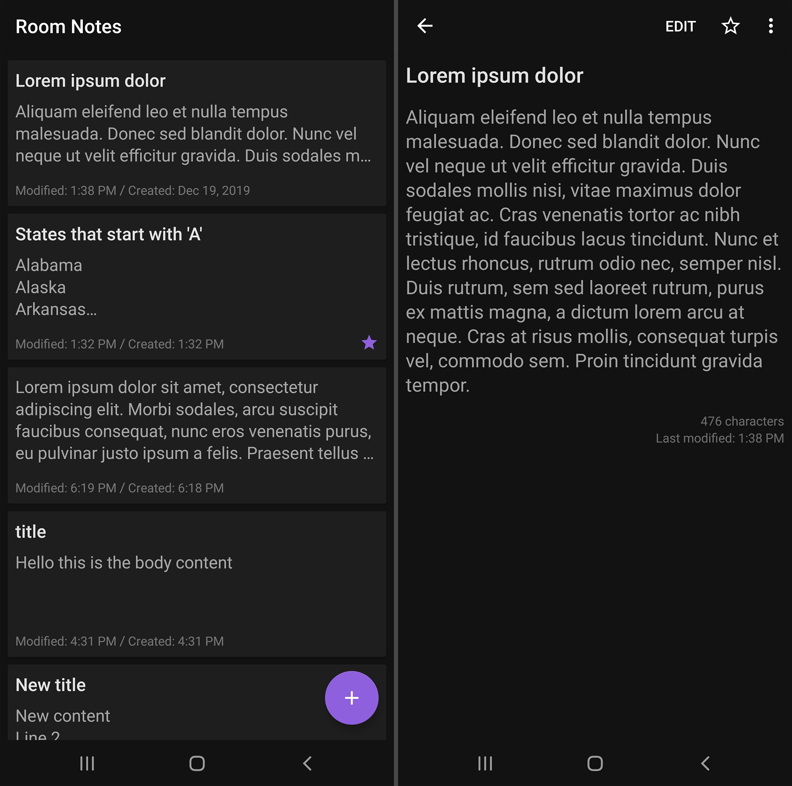

# Room Notes

Room Notes is a dark-themed notes app for Android. It uses
[AndroidX](https://developer.android.com/jetpack/androidx/)
libraries and
[Android architecture components](https://developer.android.com/topic/libraries/architecture/)
to implement the
[recommended app architecture](https://developer.android.com/jetpack/docs/guide#recommended-app-arch).

## Featured Components

Room Notes features the following Android components:

- [ViewModel](https://developer.android.com/topic/libraries/architecture/viewmodel)
and
[LiveData](https://developer.android.com/topic/libraries/architecture/livedata)
to separate UI from business logic
- [Room](https://developer.android.com/training/data-storage/room/index.html)
persistence library for on-device database storage
- [RecyclerView](https://developer.android.com/guide/topics/ui/layout/recyclerview#structure)
to present database data to the user

## What I Learned

- How to save and process data on-device with Room
- [Dark theme design guidelines](https://www.material.io/design/color/dark-theme.html)
- How to customize app-wide theme and view-specific styles
- Best practices regarding Android's recommended app architecture
- Familiarity with presenting data with RecyclerView
